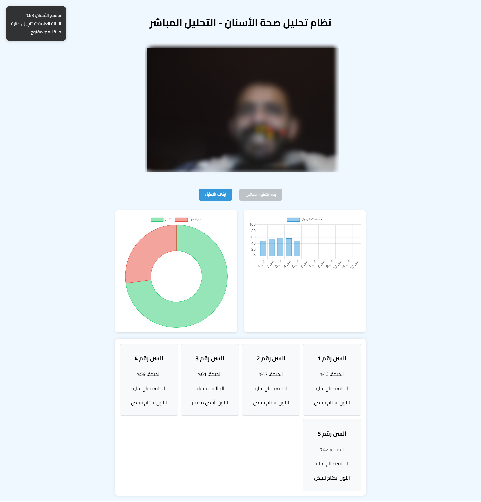

# نظام تحليل صحة الأسنان بالذكاء الاصطناعي

نظام ذكي لتحليل صحة الأسنان في الوقت الفعلي باستخدام تقنيات الذكاء الاصطناعي ورؤية الكمبيوتر.

## لقطة شاشة للنظام

## المميزات

- تحليل مباشر لصحة الأسنان باستخدام كاميرا الويب
- تحديد نسبة صحة كل سن
- قياس تناسق الأسنان
- تحليل لون الأسنان وحالتها
- رسوم بيانية تفاعلية لعرض النتائج

## التقنيات المستخدمة

- TensorFlow.js
- Face-api.js
- Chart.js
- Fabric.js
- HTML5 Canvas

## متطلبات التشغيل

- متصفح حديث يدعم WebRTC
- كاميرا ويب
- خادم ويب (مثل Apache)

## طريقة التشغيل

1. قم بتشغيل خادم الويب
2. افتح المتصفح على عنوان التطبيق
3. اسمح للتطبيق بالوصول إلى الكاميرا
4. انتظر تحميل نماذج الذكاء الاصطناعي
5. اضغط على زر "بدء التحليل المباشر"

## الترخيص

MIT License
